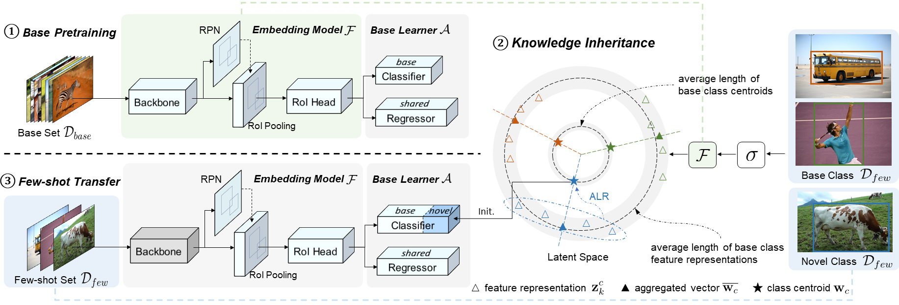

## Efficient Few-Shot Object Detection via Knowledge Inheritance

This repository contains the official implementation for the paper 
[Efficient Few-Shot Object Detection via Knowledge Inheritance](https://arxiv.org/abs/2203.12224).
The codes are built upon 
[Detectron2](https://github.com/facebookresearch/detectron2). Many thanks to
their awesome open-source library.

<div align="center">
  
</div>

We build a highly efficient pretrain-transfer framework (PTF) baseline without extra overheads for FSOD.
Upon this baseline, we devise an initializer named knowledge inheritance (KI) to reliably initialize the
novel weights for the box classifier.
Qualitative results on Pascal-VOC, COCO and LVIS demonstrate our approach sets new state of the art with
higher efficiency.
We hope to motivate a trend toward powerful yet efficient few-shot technique development.


## Installation
```
# install pytorch and cuda, please follow the versions specified in the command below
conda install pytorch==1.4.0 python=3.7 torchvision==0.5.0 cudatoolkit=10.0 -c pytorch

# clone our repo and install detectron2
git clone https://github.com/Ze-Yang/Efficient-FSOD.git
cd Efficient-FSOD && pip install -e .

# install pycocotools, lvis-api and tensorboard
pip install cython; pip install 'git+https://github.com/cocodataset/cocoapi.git#subdirectory=PythonAPI'
pip install git+https://github.com/lvis-dataset/lvis-api.git
pip install tensorboard
```
To __rebuild__ detectron2, `rm -rf build/ **/*.so` then `pip install -e .`.
You often need to rebuild detectron2 after reinstalling PyTorch.

## Get Started

### Training & Evaluation in Command Line

To train a model, run
```angular2html
python tools/train_net.py --num-gpus 4 \
        --config-file configs/COCO-detection/faster_rcnn_R_101_FPN_base.yaml
```

To evaluate the trained models, run
```angular2html
python tools/test_net.py --num-gpus 4 \
        --config-file configs/COCO-detection/faster_rcnn_R_101_FPN_ours_10shot.yaml \
        --eval-only
```

## Citing Efficient-FSOD
If you find this repository useful in your research, please consider to cite our paper with the following
BibTeX entry.
```BibTeX
@article{yang2022efficient,
  title={Efficient Few-Shot Object Detection via Knowledge Inheritance},
  author={Yang, Ze and Zhang, Chi and Li, Ruibo and Lin, Guosheng},
  journal={arXiv preprint arXiv:2203.12224},
  year={2022}
}
```

## License

This repository is released under the [Apache 2.0 license](LICENSE).

